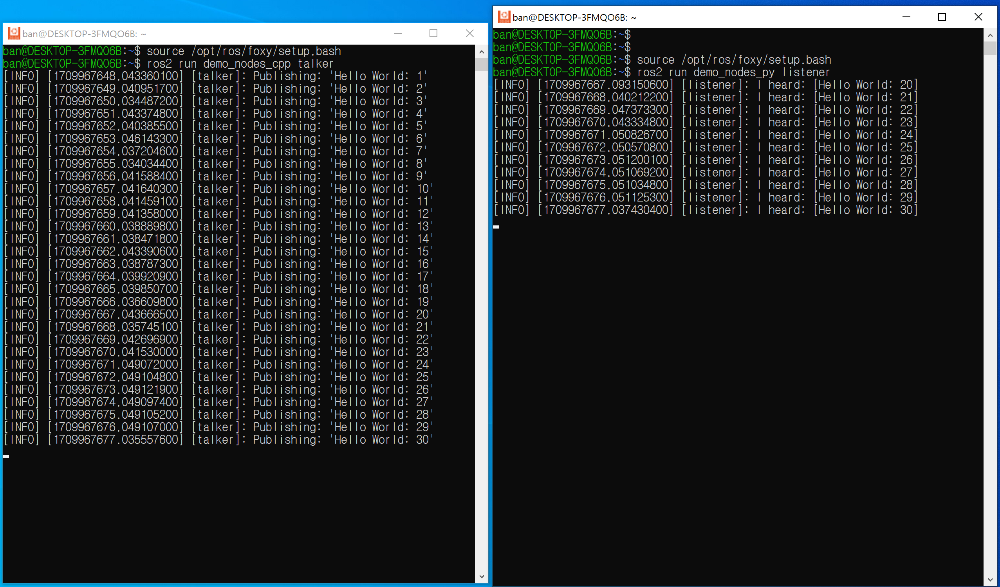

# install

## 참고

```
https://keep-steady.tistory.com/45
```


## windows
- Window + wsl2

## wsl2
- 윈도우에서 리눅스를 사용할 수 있게 해주는 WSL2 버전이 정식으로 출시
- WSL은 Windows Subsystem for Linux 2의 줄임말
- 윈도우의 가상화 기능을 활용해서 윈도우 위에서 리눅스를 사용 가능
- 단순히 가상머신으로 리눅스를 사용할 수 있는 것이 아님
- 윈도우 시스템과 통합되어 마치 하나의 머신처럼 자연스럽게 리눅스를 활용하는 것이 가능

## wsl2 install
1. WSL2: Windows Subsystem for Linux 2
2. WSL을 설치하려면 Windows 10의 20H1 이상 버전이어야 함
3. 왼쪽 아래 검색 -> 'pc 정보' 입력 -> 시스템 열기, Windows 사양의 버전 확인(20H1보다 높은지 체크)
4. 윈도우에선 기본적으로 WSL1이 활성화 되는데, 이를 WSL2가 활성화 되도록 설정 (Window PowerShell을 관리자 권한으로 열어서 아래 명령어를 친다)  

    ```
    dism.exe /online /enable-feature /featurename:Microsoft-Windows-Subsystem-Linux /all /norestart
    dism.exe /online /enable-feature /featurename:VirtualMachinePlatform /all /norestart
    wsl --set-default-version 2
    ```

## install CHOCOLATEY
1. Window PowerShell을 관리자 권한으로 열어서 아래 명령어를 친다  

    ```
    Set-ExecutionPolicy Bypass -Scope Process -Force; [System.Net.ServicePointManager]::SecurityProtocol = [System.Net.ServicePointManager]::SecurityProtocol -bor 3072; iex ((New-Object System.Net.WebClient).DownloadString('https://community.chocolatey.org/install.ps1'))
    ```
2. 확인  

    ```
    choco
    ```
3. install terminal  

    ```
    choco install -y microsoft-windows-terminal
    ```
4. install cmake
    ```
    choco install -y cmake
    ```

## Ubuntu 20.04 install
1. window store 실행후 검색하려설치
2. "WslRegisterDistribution failed with error: 0x8007019e
The Windows Subsystem for Linux optional component is not enabled. Please enable it and try again. 에러 발생하면 아래 명령어 power shell 관리자권한 실행후 아래 입력후 재부팅  

    ```
    Enable-WindowsOptionalFeature -Online -FeatureName Microsoft-Windows-Subsystem-Linux
    ``` 

## ROS 2 Foxy Fitzroy  install
1. 참고  

    ```
    https://docs.ros.org/en/foxy/Installation/Ubuntu-Install-Debians.html
    ```
2. 설치완료 확인
    ```
    source /opt/ros/foxy/setup.bash
    ros2 run demo_nodes_cpp talker
    ```
    ```
    source /opt/ros/foxy/setup.bash
    ros2 run demo_nodes_py listener
    ```
3. 터미널 각각 실행후 위 명령어 실행
4. 결과  

    

## install ubuntu visual studio code

```
sudo apt-get install curl
```

```
sudo sh -c 'curl https://packages.microsoft.com/keys/microsoft.asc | gpg --dearmor > /etc/apt/trusted.gpg.d/microsoft.gpg'
```

```
sudo sh -c 'echo "deb [arch=amd64] https://packages.microsoft.com/repos/vscode stable main" > /etc/apt/sources.list.d/vscode.list'
```

```
sudo apt-get update
```

```
sudo apt-get install code
```

```
sudo rm /etc/apt/sources.list.d/vscode.list
```

한글폰트설치
```
sudo apt-get install fonts-nanum*
```

에러 발생시
To use Visual Studio Code with the Windows Subsystem for Linux, please install Visual Studio Code in Windows and uninstall the Linux version in WSL. You can then use the `code` command in a WSL terminal just as you would in a normal command prompt.
Do you want to continue anyway? [y/N] y
To no longer see this prompt, start Visual Studio Code with the environment variable DONT_PROMPT_WSL_INSTALL defined.

삭제
```
sudo apt purge code
```

윈도우에서 visual studio code 실행후 extension 및 wsl 설치후 우분투 터미널에서 아래 실행
```
code .
```

- 해당방법은 윈도우에 vs code 설치 안되있을경우 가능할듯하며, 이미 윈도우에 vs code 가 설치되었다면 플러그이을 확장하자.

